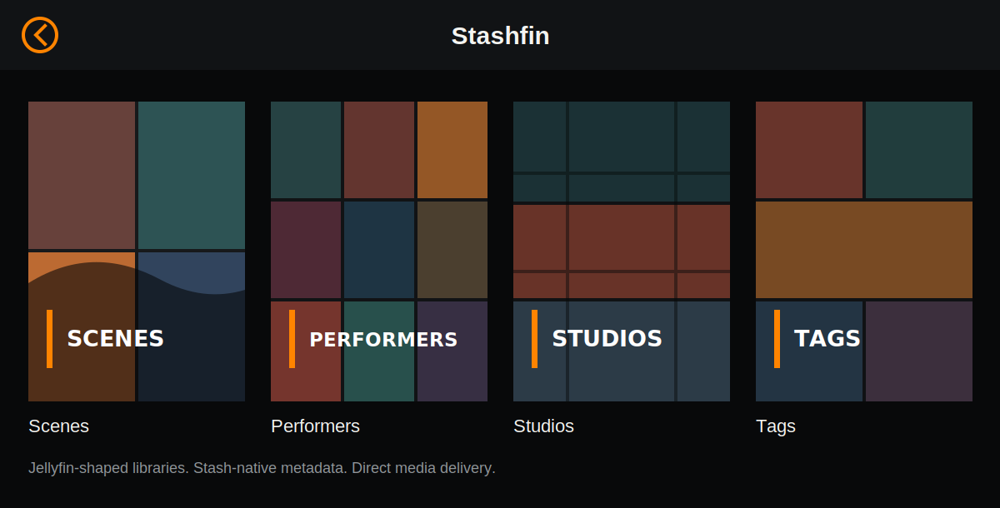
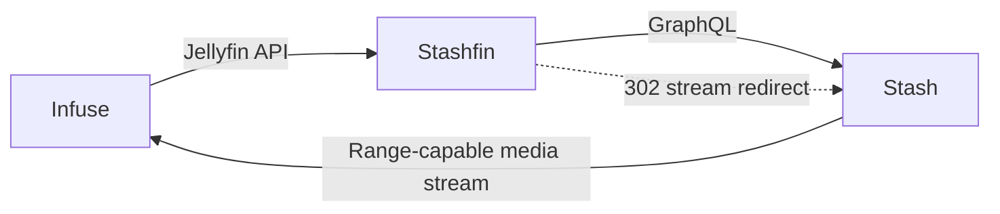

# Stashfin

Stashfin is a small Jellyfin-compatible bridge for Stash. It gives clients like
Infuse a Jellyfin-shaped catalog while keeping media bytes out of the app.

<p align="center">
  
</p>

## Design



The important split is:

- `STASH_INTERNAL_URL`: URL Stashfin uses inside Docker, usually `http://stash:9999`.
- `STASH_PUBLIC_URL`: URL Infuse can reach, for example `http://localhost:9999`
  or a VPN/LAN hostname.

Stashfin rewrites Stash-generated stream URLs from the internal origin to the
public origin. It does not proxy video chunks through Go.

## Direction

Stashfin is intentionally narrower than a full Jellyfin emulator. It is an
Infuse-first bridge for trusted local/VPN use:

- Keep the hot media path out of the app: video playback is a redirect to Stash.
- Use Stash as the source of truth: metadata, tag hierarchy, play activity,
  resume position, and ratings are written through GraphQL.
- Shape Stash into a small Jellyfin catalog: `Scenes`, `Performers`, `Studios`,
  and `Tags`.
- Prefer a few predictable conventions over a Web UI and per-client profile
  matrix.

The excellent [feldorn/Stash-Jellyfin-Proxy](https://github.com/feldorn/Stash-Jellyfin-Proxy)
project is the main reference for Jellyfin compatibility edge cases. Stashfin
borrows the useful ideas, especially hierarchy-aware tag filtering, client image
cache busting, and library cover generation. It deliberately avoids the parts
that would make this project a second media server: built-in configuration UI,
stream byte forwarding, client profile management, playlist editing, and series
emulation. Those can be added later only when they solve a real client workflow
without obscuring the core path.

## Current Scope

Implemented endpoints and features:

- `GET /System/Info/Public`
- `GET /System/Info`
- `GET /System/Ping`
- `GET /healthz`
- `POST /Users/AuthenticateByName`
- `GET /Users/{user}/Views`
- `GET /Users/{user}/Items`
- `GET /Users/{user}/Items/Latest`
- `GET /Items`
- `GET /Items/{item}`
- `GET /Persons`
- `GET /Persons/{person}`
- `GET|POST /Items/{item}/PlaybackInfo`
- `GET /Items/{item}/Images/Primary`
- `GET /Videos/{item}/stream`
- `GET /Videos/{item}/stream.mp4`
- `POST /Sessions/*`

Catalog support:

- Root views: `Scenes`, `Performers`, `Studios`, and `Tags`.
- Scene metadata: title, overview, independent added/release dates, year, rating,
  tags/genres, studio, performers, provider ids, external URLs, basic user data,
  and media sources.
- Performer/studio/tag browsing: entity roots are exposed as folder-like items,
  and opening an entity returns scenes filtered in Stash via GraphQL.
- Tag hierarchy: top-level tags appear under `Tags`; tags with children open to
  child tags plus an `All Scenes` entry that includes descendants.
- Cast: scenes expose Stash performers as Jellyfin `Person` records, while the
  `Performers` library uses browsable folder items for Infuse compatibility.
- Sorting: name, date added, release date, runtime, play count, play date, and
  rating sorts are mapped to distinct Stash sort keys where Stash supports them.
- Images: scene screenshots plus performer, studio, and tag images are exposed
  through Jellyfin image endpoints. Root libraries use generated covers from
  recent Stash content with a Stashfin treatment: artwork grid, Stash-orange
  accents, and dot-matrix library titles. Stashfin skips Stash default
  placeholder images when possible, uses URL-derived image tags for client cache
  refresh, caches resolved image URLs and generated covers in memory, and
  refreshes covers lazily after six hours. Use `?refresh=1` on a root image
  endpoint to rebuild immediately.
- Playback state: progress and stopped events update Stash resume/play activity;
  completed stops are counted as plays.

`/Videos/{item}/stream` returns a `302` redirect to the Stash-generated stream
URL after rewriting it to `STASH_PUBLIC_URL`.

## UI Model

Stashfin intentionally keeps the Jellyfin projection small and consistent:

- Top level: four library folders, `Scenes`, `Performers`, `Studios`, `Tags`.
- Browsing: folders always open to more folders or movie scenes.
- Metadata: scene cast uses Jellyfin `Person` records, but the `Performers`
  library uses folder-shaped items because Infuse browses libraries and cast
  through different data paths.
- Visual language: generated root covers share one style so Infuse feels like a
  single library, while individual scene/person/studio/tag artwork remains
  direct Stash artwork.

## Rating Notes

Jellyfin's standard like endpoint is boolean, while Stash scene ratings are
0-100. Stashfin supports numeric rating query values when a client sends them,
but it intentionally treats bare likes as a no-op by default to avoid turning a
thumb into an arbitrary five-star rating.

## Local Run

```bash
export STASH_INTERNAL_URL=http://localhost:9999
export STASH_PUBLIC_URL=http://localhost:9999
export STASH_API_KEY=...
export STASHFIN_PASSWORD=...
go run ./cmd/stashfin
```

Then add `http://localhost:8096` or the Docker-mapped port as a Jellyfin server
in Infuse.

## Docker

```bash
cp .env.example .env
$EDITOR .env
docker compose up -d --build
```

The included compose file exposes Stashfin directly on `19998` by default.
Change `STASHFIN_PUBLISHED_PORT` to run it side by side with another Jellyfin
bridge. It also includes optional Traefik labels; set `STASHFIN_TRAEFIK_RULE` in
`.env` if your edge stack uses host routing.

## Security Notes

Stash-generated stream URLs include the Stash API key in the query string. That
is acceptable for a trusted local/VPN network, but it is not a good public
internet boundary. For public exposure, put a dedicated media proxy in front of
Stash that injects the API key server-side and keeps browser-style SSO away from
Infuse playback.

## Public Project Defaults

Recommended defaults for a public release:

- Container port: `8096`, matching Jellyfin's HTTP port.
- Example host port: `19998`, matching this bridge deployment style.
- `STASH_INTERNAL_URL=http://stash:9999`
- `STASH_PUBLIC_URL` required, because clients cannot use Docker DNS names.
- `STASHFIN_PASSWORD` required by default.
- `STASHFIN_ALLOW_EMPTY_PASSWORD=false` by default.
- `STASHFIN_SERVER_ID` stable and user-provided for Docker deployments.
- `STASHFIN_TRAEFIK_RULE=Host(\`stashfin.example.test\`)` only when using the
  optional Traefik labels.

## First Release Checklist

- Keep the repository small: Go service, Dockerfile, compose example, README,
  and `.env.example`.
- Do not commit a real `.env` or Stash API key.
- Do not commit local build artifacts such as `stashfin`, `.gocache`, or
  `.DS_Store`.
- Mark the project as a Jellyfin-compatible Stash bridge for trusted local/VPN
  use, not a full Jellyfin server replacement.
- Call out the main invariant in the README and repo description: media bytes
  are redirected to Stash and do not pass through Stashfin.
